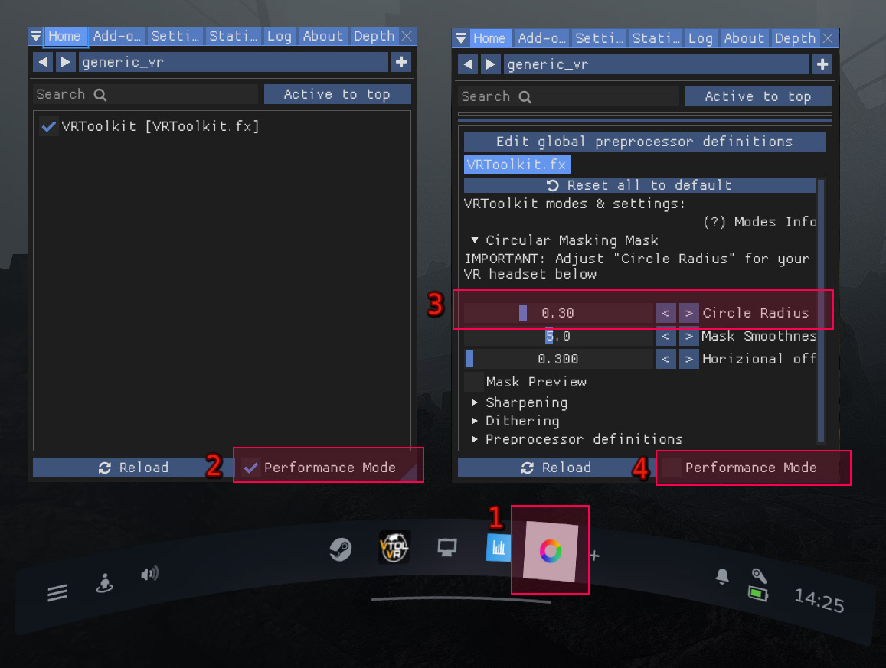

---
---

Configuration
=======

## Headset Setup
**Note:** First start the game where you have installed the toolkit to see the ReShade settings button.
(Ensure that you are in a VR scene for it to appear on a game that has been modded to work in VR)

1. Open the `SteamVR Dashboard` and click on the ReShade Settings button. (Game needs to be started in VR)
2. Un-tick `"Performance Mode"` checkbox to see the settings of the VRToolkit.
3. Use your VR pointer to Adjust the [Circle Mask](#circle-mask) matching your HMD field of view sweet spot and to your personal view range.
4. Re-enable `"Performance Mode"` when done.

### Circle Mask
Keep the radius as small as possible to conserve GPU time, but as well not to small to not loose sharpness.
In addition some HMDs need an offset correction like the Pimax to fit the sweet spot better.

You can use the Recommended settings below as a good starting point.
Use the `"Mask Preview"` checkbox to see the circle mask in cyan color for easier setup.  

|  VR Headset (HMD)                      | Circle Radius | Horizontal Offset  |
| -------------------------------------- |:-------------:| :-----------------:|
| Valve Index                            |  0.30 to 0.35 | 0.3                |
| Oculus Quest1                          |  0.30 to 0.35 | 0.3                |
| HP G1 & G2                             |  0.41 to 0.46 | 0.3                |
| Pimax 5k & 8k Large FOV, No PP         |  +- 0.23      | 0.336              |

### Hotkeys: 

- **CTRL+PRINT**  => Creates a screenshot in the `.\ReShade\Screenshots` folder
- **CTRL+END** => Toggle all Reshade effect on/off *(Does not work in VR view yet)*
- **CTRL+POS1/HOME** => Enter Reshade config menu *(not visible in VR, only in the SteamVR desktop window)*.
  Use the SteamVR Dashboard instead.