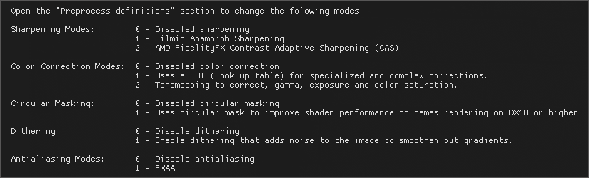

---
---

Configuration
=======

## Headset Setup

1. Open the `SteamVR Dashboard` and click on the ReShade Settings button.
2. Un-tick `"Performance Mode"` checkbox to see the settings of the VRToolkit.
3. Use your VR pointer to Adjust the [Circle Mask](#circle-mask) matching your HMD field of view sweet spot and to your personal view range.
4. Re-enable `"Performance Mode"` when done.

### Circle Mask
Keep the radius as small as possible to conserve GPU time, but as well not to small to not loose sharpness.
In addition some HMDs need an offset correction like the Pimax to fit the sweet spot better.

You can use the Recommended settings below as a good staring point.
Use the `"Mask Preview"` checkbox to see the circle mask in cyan color for easier setup.  

|  VR Headset (HMD)                      | Circle Radius | Horizontal Offset  |
| -------------------------------------- |:-------------:| :-----------------:|
| Valve Index                            |  0.30 to 0.35 | 0.3                |
| Oculus Quest1                          |  0.30 to 0.35 | 0.3                |
| HP G1 & G2                             |  0.41 to 0.46 | 0.3                |
| Pimax 5k Large FOV, No PP              |  +- 0.75      | ?                  |

## Configure Preset 
*(For Experienced Users Only)*

You can adjust the VRToolkit settings by changing the shader modules and settings it has available.
The base `generic_vr` preset is configured to work without modification for almost all VR titles 
to look natural without artifacts. 

Its best to work on the vr mirror on the monitor while creating a new preset and fine tweak it later in VR.

1. Click on the **+** icon near the `generic_vr` preset to create a duplicate of the generic preset.
2. Un-tick `"Performance Mode"` checkbox to see the settings of the VRToolkit.
3. Hover over the `(?) Usage Help (?)` on the ReShade settings menu to see available modes.
4. Adjust settings to tweak the setting to your taste.
5. Re-enable `"Performance Mode"` when done.

### Hotkeys: 

- **CTRL+PRINT** => Creates a screenshot in the `.\ReShade\Screenshots` folder
- **CTRL+END** => Toggle all Reshade effect on/off *(Does not work in VR view yet)*
- **CTRL+POS1/HOME** => Enter Reshade config menu *(not visible in VR, only in the SteamVR desktop window)*.
  Use the SteamVR Dashboard instead.