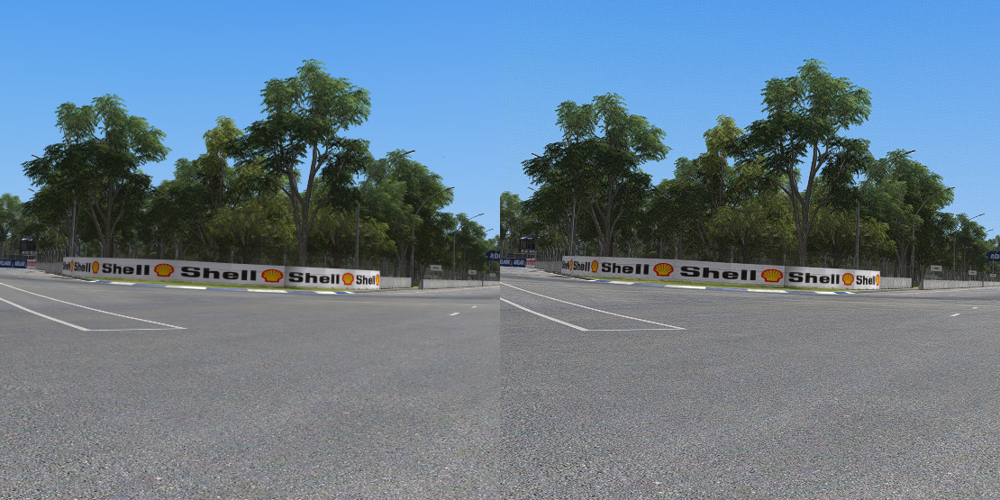

---
---

VRToolkit
=======

The VRToolkit is a modular shader created for [ReShade](https://github.com/crosire/reshade)
to enhance the clarity & sharpness in VR to get most out of your HMD while keeping the performance impact minimal.

### Main Features

- Sharpening Modes for enhanced clarity while only processing the pixels that are in the sweet spot of your HMD
- Color Correction Modes to be able to adjust your HMD colors & contrast to your liking
- Dithering to reduce banding effects of gradients and sharpening artifacts
- All modules are processed in a single render pass post shader to improve performance instead of having them all separate

### 100% Crop Comparision:
Check out in full screen to see the difference better.
(Still its not comparable as how much better it looks in VR)

#### Half Life Alyx
Beginning scene that shows a crop of the center of the left eye.

**Left:** Original **Right:** VRToolkit 

[Show Full Image](./assets/images/vrtoolkit_comparision_alyx_full.jpg)

#### Automobilista VR MOD
Adelaide 1988 Racetrack Dequetteville Hairpin

**Left:** Original **Right:** VRToolkit

[Show Full Image](./assets/images/vrtoolkit_comparision_ams_full.jpg)