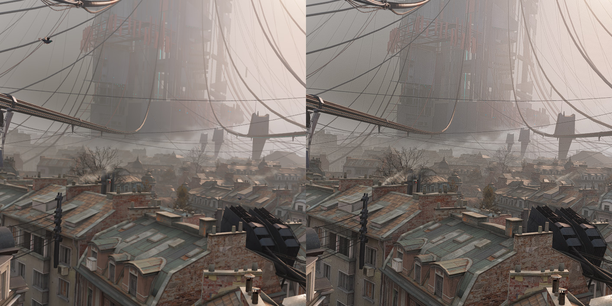

---
---

VRToolkit
=======

The VRToolkit is a modular shader created for [ReShade](https://github.com/crosire/reshade)
to enhance the clarity & sharpness in VR to get most out of your HMD while keeping the performance impact minimal.

### Main Features

- Sharpening Modes for enhanced clarity while only processing the pixels that are in the sweet spot of your HMD
- Color Correction Modes to be able to adjust your HMD colors & contrast to your liking
- Dithering to reduce banding effects of gradients and sharpening artifacts
- All modules are processed in a single render pass post shader to improve performance instead of having them all separate

*Note: ReShade currently only works on games run through SteamVR. (OpenVR API)*

### 100% Crop Comparision: 
Half Life Alyx begining scene that shows a crop of the center of the left eye.
Check out in full screen to see the difference better. (In VR the effect looks even better)

**Left:** Original **Right:** VRToolkit 

[Full Image ~4Mb](./assets/images/vrtoolkit_comparision_large.jpg)