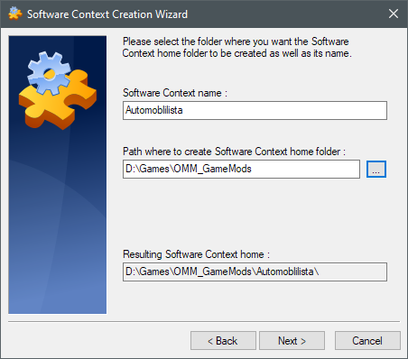
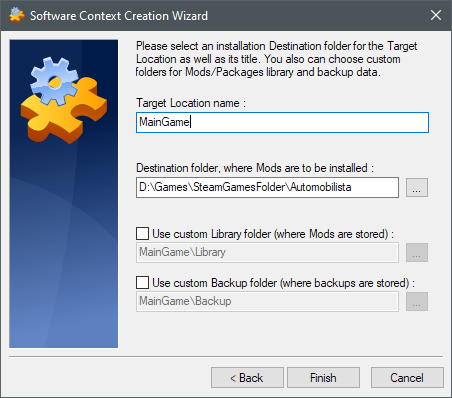
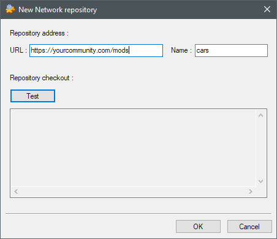
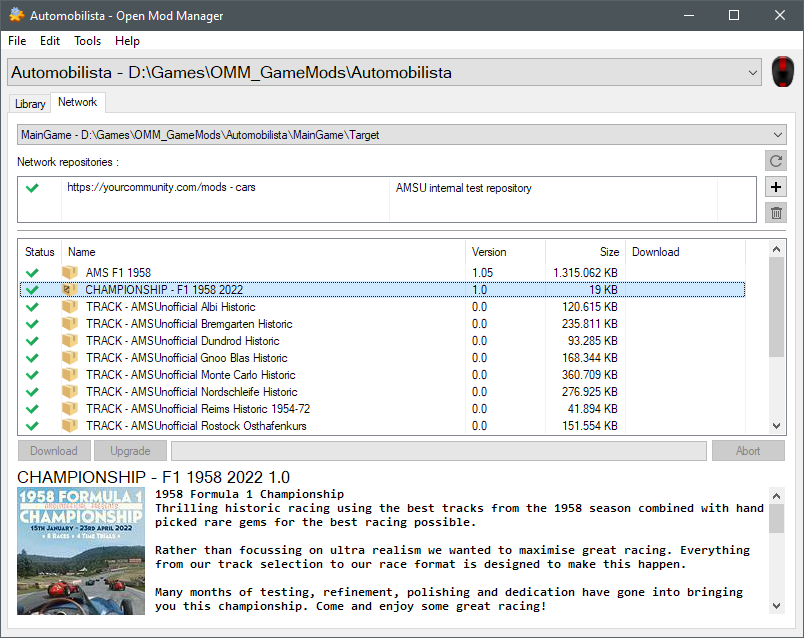
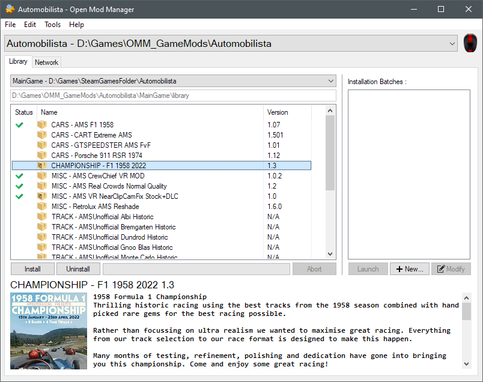

---
---

Quick Start tutorial
=======
This is a quick start tutorial to set up the Open Mod Manager (OMM) and setup your first game. For more information
check out the [official wiki](https://github.com/sedenion/OpenModMan/wiki/)

## 1. Open Mod Manager Preparation

1. Download the latest release of the [Open Mod Manager (OMM)](https://github.com/sedenion/OpenModMan/releases).
   (At best use the 64bit version)
2. Install the Open Mod Manager to your desired install location.
   (Single installation used for all Games `eg. D:\Games\OMM`)
3. Create a folder where all your mods will be placed to used as context root. 
   At best place it where you have plenty of space available. `(eg. D:\Games\OMM_GameMods)`

-----------------------------------------------------------------------------------------------------------

## 2. Game Preparation for Mods (Software Context)

Recommended setup for a game to allow easy mod management.

1. Start up OMM
2. Prepare you Game for mods
    1. `File -> New -> Software Context` (This represents the Game that you want to install mods to.)
    2. Set the path and name it to the game you want to mod. `(eg. D:\Games\OMM_GameMods\Automobilista)`
       
       
    3. Set the path for the target where the mods should be installed into. 
        Keep the mods and backup folder to their default location.
       
       
3. Open up the created context by  `File -> Open` or `File -> Recent contexts`

**TIP:**
Set that the just created context will automatically opened when OMM is started.

1. `Edit -> Manager Options...`
2. Add created Context to list. You can add multiple ones that can easily selected in OMM when started.

-----------------------------------------------------------------------------------------------------------

## 3. Add & Install Mods

To be able to add mods you your created game context you have two options:

### A. Network repositories

Uses mod URLs of your communities to be able download mods directly within OMM.
*(Easiest way if your community supports it)*

1. Open up the desired game context by  `File -> Open` or `File -> Recent contexts`
2. Switch from the `Library Tab` to the `Network Tab`
3. Add URL to your community mod repository with the `+ button`. (Use the test button to validate)

   
4. Refresh the repository's with the `circle arrow button` to fetch all available/updated mods.

5. Select your desired mods and download/update them into your [Mod Library](#b-local-mod-library)
   folder `(eg. D:\Games\OMM_GameMods\Automobilista\MainGame\Library)`

      

### B. Local Mod Library

All mods need to be in your Mod Library folder to be able to activate/deactivate them for your game.
When using network repositories they will be downloaded into your library automatically for you.

**OMM or OvGME prepared Mods**

1. Open up the desired game context by  `File -> Open` or `File -> Recent contexts`
2. Copy the mod *.zip to your library folder of your game
   context `(eg. D:\Games\OMM_GameMods\Automobilista\MainGame\Library)`
3. Added mods should now show up under the library tab (will be auto refreshed by OMM).
   If they are not shown then they need to be [prepared for OMM usage](#prepare-mods-for-omm-usage).
  
-----------------------------------------------------------------------------------------------------------

## 4. Activate & Deactivate Mods
*Note:* On activation of a mod it will create a backup of all replaced files to restore them.

1. Open up the desired game context by  `File -> Open` or `File -> Recent contexts`
2. Single click on the desired mod to see its description.
3. Double click on the desired mod to activate/deactivate it.
   If there are dependencies (different icon) required it will ask to install them along or warn if not present.

-----------------------------------------------------------------------------------------------------------

## Prepare Mods for OMM usage (WIP)
*(For Experienced Users)*

To be able to use a mod in OMM they often need to prepared to be usable.

1. Extract zip contents into a new folder named as your zip of the mod into your library folder `(eg. D:\Games\OMM_GameMods\Automobilista\MainGame\Library)`
2. Go into the extracted folder and check the structure follows the one from your game target root folder contents.
   It should NOT contain the folder name of the of the game target itself `(eg. .\Automobilista\)`
3. Move the folders to match the structure of your game.
4. Open up the desired game context by  `File -> Open` or `File -> Recent contexts` in OMM
5. The newly added folder should be visible in the `Library Tab`
6. Right clicking on the folder of your extracted mod in OMM and select `Load in Package Editor...`
7. Edit Mod details are you see fit (Icon, Description etc.)
8. Save when finished and it will create a zip inside your library that is ready to be used in OMM
9. You can now remove the old mod folder by right clicking it and select `Move to Recycle Bin`.
