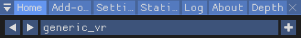
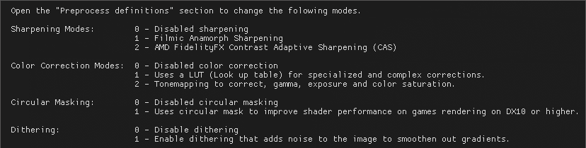

---
---

Presets
=======

The VRToolkit comes with several presets that can be selected to suit your desired look.  
Select the prests below by using the arrow buttons on the left side of the preset.  

`generic_vr` (Default)  
Base preset is configured to work without modification for almost all VR titles to look 
natural without adding artifacts.

`generic_vr+`  
Sharper than the base preset, balanced to not introduce a lot artifacts. 

`generic_filmic_vr`  
Like the base preset but uses "Filmic Anamorph Sharpening" for sharpening instead & dithering to reduce banding.

`generic_filmic_vr+`  
Sharper than the filmic preset but introduces artifacts.

### How to select a Preset

1. Switch through the presets by using the arrow buttons near the preset name.
2. Re-adjust your mask settings as each preset stores its own settings

## Custom Preset
*(For Experienced Users Only)*

You can adjust the VRToolkit settings by changing the shader modules and settings it has available.
Its best to work on the vr mirror on the monitor while creating a new preset and fine tweak it later in VR.

1. Click on the **+** icon near the `vr_generic` preset to create a duplicate of the generic preset.
2. Un-tick `"Performance Mode"` checkbox to see the settings of the VRToolkit.
3. Hover over the `(?) Modes Info` on the ReShade settings menu to see available modes.
4. Adjust settings to tweak the setting to your taste.
5. Re-enable `"Performance Mode"` when done.

